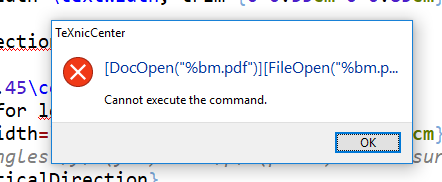
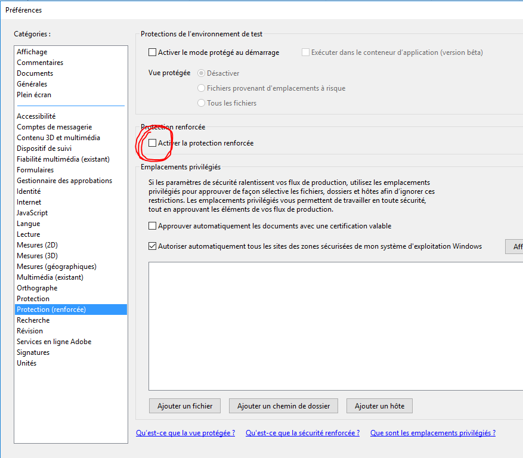
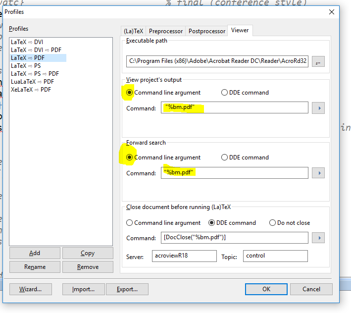

# 16/01/18 - Texnic Center crashes when opening pdf

## Problème

## Cause
Protection sur Acrobat reader qui empêche d'ouvrir le fichier avec la commande

## Solution
Dans Acrobat reader:

Dans Texnic Center , Alt+F7 ouvre la fenetre suivante:

