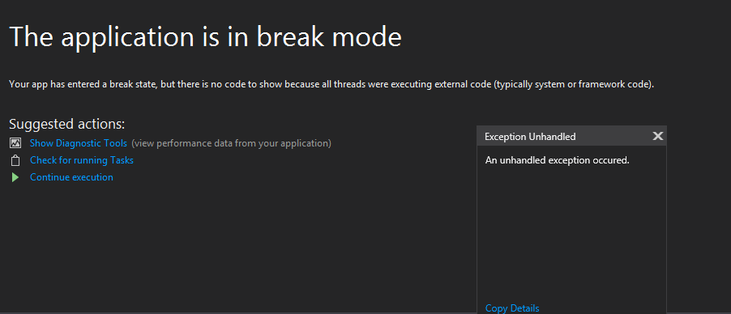

# 12/11/18 - Visual Studio Python won't debug

## Tags 
Python, Debug
## Problème: 
The app won't stop on breack points

## Cause 
Mauvais paramètre
## Solution: 
Debug > Options > General > Uncheck "Enable Just My Code"
Puis redémarer Visual Studio 

## Commentaire
Le pb peut aussi être lié à une erreur dans le code
## Image

## Source
https://stackoverflow.com/questions/44418120/visual-studio-2017-studio-showing-error-this-application-is-in-break-mode-and
