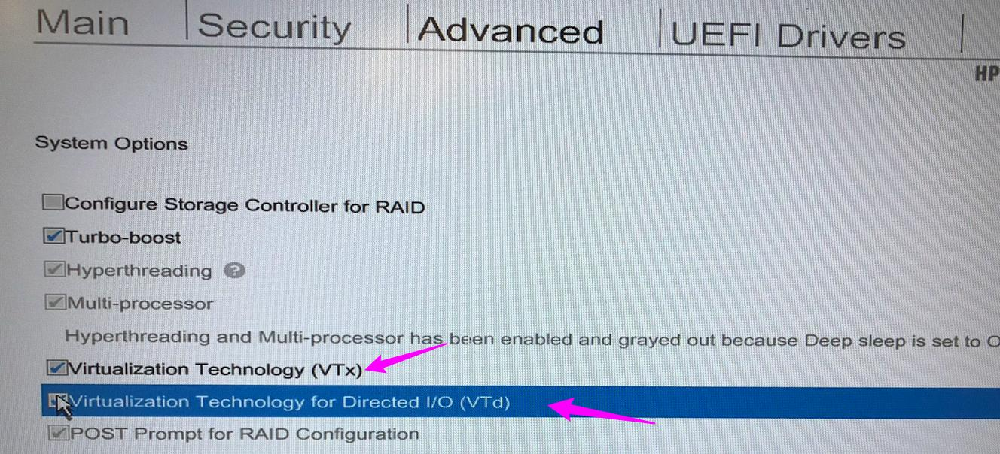

# 21/12/18 - Installation dual boot Windows 7 / Ubuntu 18.04.1 LTS (64bits)

## Tags 
Dual boot, Ubuntu, Windows, HP ZBook

## Repartition de l'espace

Pour 30Go :

Volume | Path | Size
--- | --- | ---
Ext4  |  /      |  15 Go
Ext4  |  /home  |  10 Go
Swap  |         |  5 Go

## Problèmes

 1. [Pas de disque pour graver l'image d'Ubuntu ](###1.Pasdedisquepourgraverl'imaged'Ubuntu)
 2. [Ubuntu lancé depuis la clé bootable freeze au démarage](###2.Ubuntulancédepuislaclébootablefreezeaudémarage)
 3. [Ne peux pas créer de nouvelles partitions dans Ubuntu sur l'espace libre](###3.NepeuxpascréerdenouvellespartitionsdansUbuntusurl'espacelibre)
 4. [L'installation d'Ubuntu plante avant la fin](###4.L'installationd'Ubuntuplanteavantlafin)
 5. [L'ordinateur boot sur Windows sans rien demander après installation d'Ubuntu](###5.L'ordinateurbootsurWindowssansriendemanderaprèsinstallationd'Ubuntu)

### 1. Pas de disque pour graver l'image d'Ubuntu 
  Use [Rufus](https://rufus.ie/) to create a bootable usb key
  
### 2. Ubuntu lancé depuis la clé bootable freeze au démarage

Source: https://askubuntu.com/questions/861743/installation-of-ubuntu-16-04-from-a-usb-drive-freezes

My situation (HP zBook ZBook 15 G3) is to disable the Disable Hybrid Graphics in BIOS, no need more GRUB editing.
1. Press F10 (for HP) immediately and repeatedly when the system boot, and you will go to BIOS setup utility.
2. Go to Advanced -> Built-In Device Options (or Device Configurations in G1 and G2)
3. Select Discrete Graphics for Graphics. (Default is auto), and save and exit. 

	
What I've done additional is enable the Virtualization Technology and disable the Fast Boot.
1. BIOS setup utility -> Advanced -> System Options: 
   - check: Virtualization Technology (VTx)
   - check: Virtualization Technology for Directed I/O (VTd) 
   

2. BIOS setup utility -> Advanced -> Boot Options: 
 - uncheck: Fast Boot 
 
		
By the way, I didn't disable the Secure Boot Configuration like some of post shows. Here my settings for your reference: 

### 3. Ne peux pas créer de nouvelles partitions dans Ubuntu sur l'espace libre
	
Source : https://forum.ubuntu-fr.org/viewtopic.php?id=415515

	
#### Symptôme
l'espace libre est indiqué comme "unsuable" (inutil.) au lieu de "espace disponible"
#### Cause
Limitation à 4 partitions primaires, hors sur un PC HP on en a déjà 4, il faut en supprimer une via le gestionnaire de partition de windows.
#### Solution
Supprimer une partition primaire. J'ai donc supprimé HP_TOOL après avoir sauvegardé son contenu.

### 4. L'installation d'Ubuntu plante avant la fin
#### Symptôme 
Impossible d'installer Grub
#### Cause 
Blocage à cause de l'UEFI
#### Solution 
Booter sur la clé d'installation en mode Legacy (= non UEFI).
Pour ce faire, aller dans les Setup Bios en appuayant sur echap (sur l'HP Zbook) et selectioner sur quoi on boot. Choisir Legacy - USB stick …   au lieu de UEFI - USB stick ….Dans ce cas l'installation marche.
	
### 5. L'ordinateur boot sur Windows sans rien demander après installation d'Ubuntu
Dans le bios (F10 au démarage sur HP Zbook), changer l'ordre de boot pour les boots UEFI et Legacy. (Laisser le boot sur clé usb en premier) et mettre celui sur Ubuntu en deuxième.
